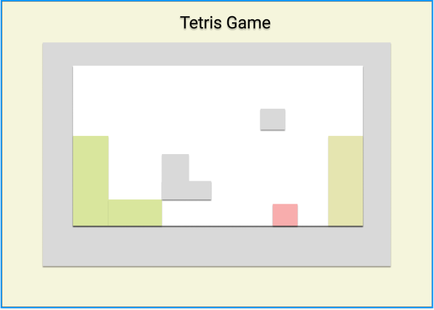

# **Tetris Game**

## **_Date: 6/30/2025_**

### **_By: Malak Jasim_**

[Website](www.)

### **_Description_**

_The project goal is to evaluate and showcase my skills in building a game browser website, the game I have chosen is the Tetris game, a block game where the player has to fit the blocks into each other in puzzle pattern to win, I have chosen this idea because it seemed unique to me, and a challenge as well, it will not be easy but I will try my best._

### **_How to get Started_**

_Firstly I clone the repository link and began executing_
_I start by altering the html files structure and immediatily start working on javascript file and adding the nesscary functions, When the player starts the game, they will have to choose wisely where to place the blocks. If they make a wrong move and mess up the block structure, they will have to restart. you score each time you place the blocks without overflowing._

_1- set up the game structure, rows and columns and the grid_

_2- define all the tertis shapes which are:
O, L, J, I, S, T, Z_

_3- let the player choose a random shape_

_- Set a position of current piece at top center of grid_
_- Start game loop (runs every second):_

_-> Move current piece down by one row_

_-> If the piece hits the bottom or another piece:_

_- Lock the piece into the grid_

_- Check if any rows are full_

_-> If yes, clear the full rows_

_-> Move rows above down_

_-> Add score_

_- Pick a new random piece as the current piece_

_- If the new piece immediately collides:_
-> GAME OVER

### **_Credits_**

_Done by Malak Jasim_
